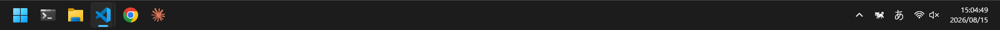
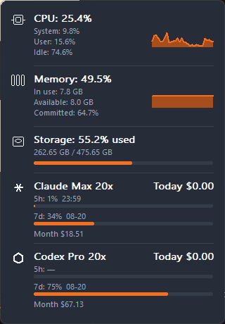

# RunDog

<p align="center">通知領域で元気に走る、軽量な CPU モニター。</p>

<p align="center"><a href="https://tsuyoshi-otake.github.io/run-dog/">紹介ページ</a></p>

<p align="center">
  
</p>

<p align="center">
  
</p>

`RunDog` は、Windows の通知領域で CPU 使用率に応じて犬の 3 フレーム・アニメーションを表示する、低負荷の Rust 製常駐アプリケーションです。犬にポインターを重ねると、CPU / メモリ / ストレージと Claude Code / Codex CLI の利用状況がカードで開きます。

## 機能

- `GetSystemTimes` の累積値差分による全体 CPU 使用率と、`GlobalMemoryStatusEx` によるメモリ使用率、システムボリュームの使用量。ホバーで CPU / メモリ / ストレージのカードと直近 1 分のスパークライン、Claude Code / Codex CLI のサブスクリミットと API 相当利用料を表示
- CPU 使用率に応じた 5–40 FPS のアニメーション（既定の上限は 20 FPS）
- System / Light / Dark テーマ、10 / 20 / 30 / 40 FPS 上限の右クリックメニュー
- Windows のスタートアップで起動、初回トレイ登録時の通知領域ピン留め（ユーザーが隠した場合は維持）、ダブルクリックによる Task Manager 起動、Explorer 再起動後の tray 再登録
- GitHub Releases の stable release を起動時に一度だけ非同期確認し、検証済みの新版をサイレント導入
- 単一インスタンス、単一 message-loop thread、GUI framework / polling thread / 常時 I/O なし

配備された `dark-dog-*.ico` は ICO ヘッダーではなく 32×32 ARGB BMP です。RunDog は起動時に検証して `HICON` を一度だけ作成します。原画は暗い犬で、ライトなタスクバーでは原画、ダークなタスクバーでは alpha を保った反転色を使います。アニメーション中にファイルを読み直しません。

## ビルド

Windows の MSVC Rust toolchain で実行します。

```powershell
cargo build --release
```

成果物は `target\release\RunDog.exe` です。実行するとコンソールを表示せず、通知領域に常駐します。終了はアイコンの右クリックメニューから行います。

## 自動更新と配布

RunDog は起動時に一度だけ、GitHub Releases の latest published stable release
を短命なバックグラウンド worker で確認します。新しい stable release があれば右クリック
メニューに `Install RunDog vX.Y.Z` を出し、通知します。ダウンロードと installer 起動は
メニューからの明示操作があるときだけ行います。常時ポーリングはしません。

ユーザーが Install を選ぶと、固定名の installer と SHA-256 sidecar がそろい、asset URL が
設定済み repository と release tag へ一致する場合だけ、installer を 16 KiB 単位でディスクへ
stream して照合します。照合に成功すると Inno Setup を
`/VERYSILENT /SUPPRESSMSGBOXES /NORESTART /CLOSEAPPLICATIONS` で起動し、既存の RunDog を
正常終了して同じ per-user install path を更新・再起動します。worker と WinHTTP handle は
この一回の処理後に解放されます。右クリックメニューでは確認中・更新中・失敗などの状態を
確認でき、必要なら手動で再確認できます。

この仕組みは token を埋め込まないため、配布先の GitHub repository と Release assets
は public である必要があります。private repository の Releases は認証なしの client
から取得できません。Release binary には CI で `RUN_DOG_UPDATE_REPOSITORY` として
実際の `owner/repository` を埋め込みます。

Authenticode の証明書・署名は使用しません。そのため Windows SmartScreen 等の警告が
出る可能性があります。SHA-256 sidecar は転送破損・取り違えを fail-closed にする
検査であり、コード署名の代替や、GitHub repository 自体が侵害された場合の真正性保証
ではありません。stable release の公開権限を保護し、利用者はこの制約を理解した上で
導入してください。

ローカルで unsigned installer を作るには Inno Setup 6 を導入してから次を実行します。

    .\scripts\build-installer.ps1 -Version 1.1.0

作成物は `dist\RunDog-Setup-x64.exe` と
`dist\RunDog-Setup-x64.exe.sha256` です。タグ `vX.Y.Z` を push すると
[release workflow](.github/workflows/release.yml) が同じ asset pair を GitHub Release
へ公開します。asset contract は [installer/README.md](installer/README.md) にあります。

## リソース方針とリリース版の実測

CPU サンプリングは 2 秒ごと、静止に近い時のアニメーションは 5 FPS（200 ms）です。CPU 使用率により速度が変わったときだけ timer を再設定し、設定はユーザー操作または正常終了時だけ保存します。更新確認は起動時とユーザーによる再確認時だけで、release metadata は最大 1 MiB、checksum は最大 16 KiB、installer は最大 100 MiB として stream 処理します。Claude Code / Codex の利用料は CLI を起動せず、メタデータでサイズが増えた jsonl だけを 1 tick あたり最大 3 ファイル・96 KiB 読み、Claude のリミット取得は 5 分に 1 回・短命 worker に限定します。

2026-08-15 に、公開済みの pre-release [v0.1.0 asset](https://github.com/systemexe-research-and-development/run-dog/releases/tag/v0.1.0) の `RunDog-Setup-x64.exe`（SHA-256 `8331cb50602e74170956147d488362868678c45149a3503a7f64cfce70d0798e`）を実インストールし、常駐が落ち着いたアイドル状態を測定しました。対象環境は Windows 11 Pro 10.0.26200（Intel N150、4 logical processors）、既定の 20 FPS 上限です。60 秒以上のウォームアップ後、[scripts/measure.ps1](scripts/measure.ps1) を `-DurationSeconds 60 -IntervalMilliseconds 1000` で実行し、60 標本の P95 は nearest-rank で算出しました。CPU は 1 コアではなくマシン全体に占める割合です。

| 指標 | 平均 | P95 | 最大 | 初期予算 | 評価 |
| --- | ---: | ---: | ---: | ---: | --- |
| CPU（マシン全体） | 0.0579% | 0.3864% | 0.3894% | 平均 0.10%、P95 0.25% 以下 | 平均は達成、P95 は未達 |
| Working Set | 15.625 MiB | 15.625 MiB | 15.625 MiB | 12 MiB 以下 | 未達 |
| Private Bytes | 2.328 MiB | 2.328 MiB | 2.328 MiB | 8 MiB 以下 | 達成 |
| Handles | 245 | 245 | 245 | 100 以下 | 未達 |
| Threads | 2 | 2 | 2 | 2 以下 | 達成 |

同じ PC で以前に採った RunCat v2.0.0 の 30 秒暫定ベースラインとの参考比較では、RunDog の平均 CPU は 81.5%、Working Set は 65.0%、Private Bytes は 90.6%、Handles は 45.6% 少ない値でした。比較時間が 30 秒対 60 秒で完全に同一ではないため、これは方向性の確認であって厳密な性能ゲートの合格証明ではありません。

したがって、常駐時の平均 CPU と Private Bytes は軽量な水準を確認できましたが、全ての初期性能予算を満たしたとは主張しません。特に P95 CPU、Working Set、Handles と、8 時間 soak は未達または未測定です。これらを profiler で分解してから閾値を変更せずに改善することを残課題とします。性能目標と再現手順は [PLAN.md](PLAN.md) に記載しています。

## テスト

```powershell
cargo fmt --check
cargo clippy --all-targets --all-features -- -D warnings
cargo test --all-targets
cargo +nightly llvm-cov --all-targets --json --summary-only --output-path target\coverage-summary.json
```

[TESTING.md](TESTING.md) は、C2（condition coverage）、PBT、ISTQB コンポーネントテスト、Fake のみを使う非ライブ結合テストの範囲を定義しています。更新 protocol のテストも fixture の release metadata と checksum manifest だけを使います。テストは HKCU、実トレイ、Task Manager、実 CPU API、ネットワークに触れません。

## 範囲

初期版は、ローカルで解析した RunCat 2.0.0 と同じ CPU 表示・アニメーション・テーマ・速度上限・起動時実行・Task Manager 導線を対象とします。GPU/メモリ可視化、ゲーム、Runner 種別の拡張はこの版の対象外です。

## 謝辞

RunDog は [RunCat365](https://github.com/runcat-dev/RunCat365) を機能上の参考にしています。詳細は [THIRD_PARTY_NOTICES.md](THIRD_PARTY_NOTICES.md) を参照してください。

## License

RunDog は [MIT License](LICENSE) で提供します。
